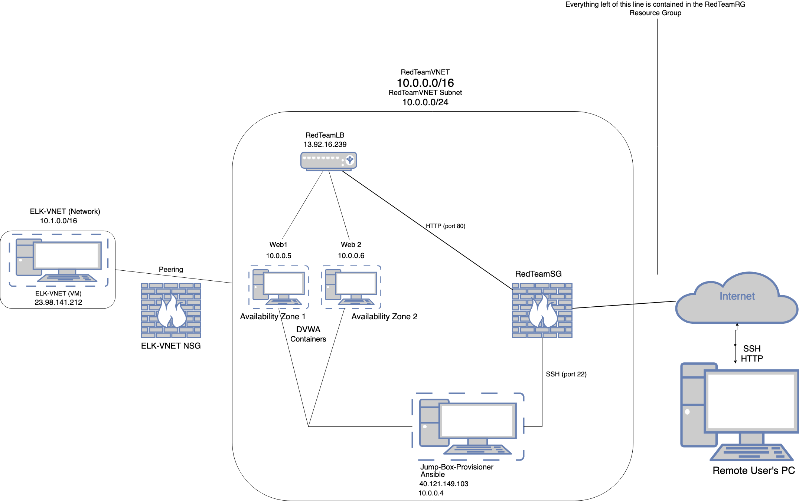
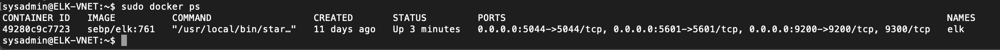

# Azure-DVWA
A repository for information on a load-balanced DVWA instance deployed on Microsoft Azure.
## Automated ELK Stack Deployment

The files in this repository were used to configure the network depicted below.

These files have been tested and used to generate a live ELK deployment on Azure. They can be used to either recreate the entire deployment pictured above. Alternatively, select portions of the playbook file may be used to install only certain pieces of it, such as Filebeat.

NOTE: All IP addresses included in this Readme, as well as any Ansible hosts, config, and playbook files, are subject to change in your own Azure iteration of this project. Please explore this as a first troubleshooting option if you run into problems. 

This document contains the following details:
- Description of the Topology
- Access Policies
- ELK Configuration
  - Beats in Use
  - Machines Being Monitored
- How to Use the Ansible Build

### Description of the Topology

The main purpose of this network is to expose a load-balanced and monitored instance of DVWA, the D*mn Vulnerable Web Application.

Load balancing ensures that the application will be highly available, in addition to restricting access to the network.
- A jumpbox is used as the only public-facing entitiy within the deployment. 
- This juumpbox is configured with an Security Group rule within Microsoft Azure to only accept SSH traffic from my home IP address and private SSH key pair.
- From this jumpbox all Docker containers for the DVWA and ELK stack server can be accessed. 

The configuration details of each machine may be found below.
_Note: Use the [Markdown Table Generator](http://www.tablesgenerator.com/markdown_tables) to add/remove values from the table_.

| Name     | Function | IP Address | Operating System |
|----------|----------|------------|------------------|
| Jump Box | Gateway  | 10.0.0.4   | Linux            |
| Web1     | DVWA     | 10.0.0.5   | Linux            |
| Web2     | DVWA     | 10.0.0.6   | Linux            |
| ELK-VNET | ELK Stack| 10.1.0.4   | Linux            |
### Access Policies

The machines on the internal network are not exposed to the public Internet. 

Only the Jump-Box-Provisioner machine can accept connections from the Internet. Access to this machine is only allowed via SSH from the admin's home IP address. 

Machines within the network can only be accessed by SSH.
- only the Docker container running on Jump-Box-Provisioner can access the ELK server via SSH. 

A summary of the access policies in place can be found in the table below.

| Name     | Publicly Accessible | Allowed IP Addresses |
|----------|---------------------|----------------------|
| Jump Box | Yes                 | Home IP              |
| Web1/Web2| No                  | Jump Box IP          |
| Load Bal.| Yes                 | Home IP              |
| ELK      | No                  | Jump Box IP          | 
### Elk Configuration

Ansible was used to automate configuration of the ELK machine. No configuration was performed manually, which is advantageous because this gives us the ability to scale up the network with minimal effort. 

The playbook implements the following tasks:
- Installs Python3 pip3 and Docker
- Allocates more memory to the ELK VM
- Pulls ELK Docker container 

The following screenshot displays the result of running `docker ps` after successfully configuring the ELK instance.

### Target Machines & Beats
This ELK server is configured to monitor the following machines:
- Web 1 and Web 2, running at local IPs 10.0.0.5 and 10.0.0.6 respectively.
We have installed the following Beats on these machines:
- Filebeat 
- Metricbeat

These Beats allow us to collect the following information from each machine:
- Filebeat collects data on Docker container usage on the Web1 and Web2 servers.
- Metricbeat collects information on system resource usage for Web1 and Web2 servers. 

### Using the Playbook
In order to use the playbook, you will need to have an Ansible control node already configured. Assuming you have such a control node provisioned: 

SSH into the control node and follow the steps below:
- Copy the config files for the Filebeat and Metricbeat playbooks to /etc/ansible/files -- modify these configs as well as your /etc/ansible/hosts file to make sure they're using the proper IPs for your iteration of this project. 
- Update the config files to include the hosts to be acted upon, as well as correct IP addresses for ElasticSearch and Kibana hosts. 
- Run the playbook, and navigate to the Kibana installation page for the beats to check that the installation worked as expected and Kibana is receiving data.

To verify that the ELK server is running, visit http://104.210.145.121:5601/app/kibana from an allowed IP address.
